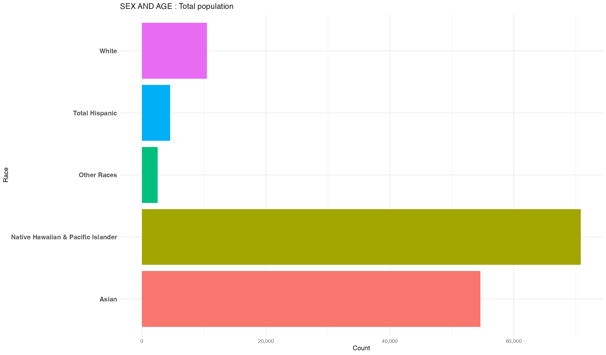
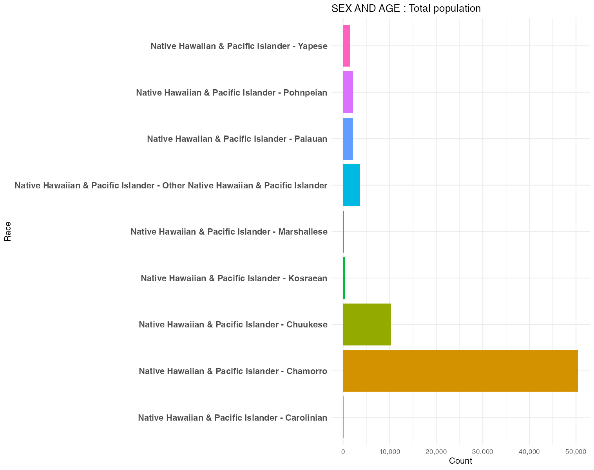
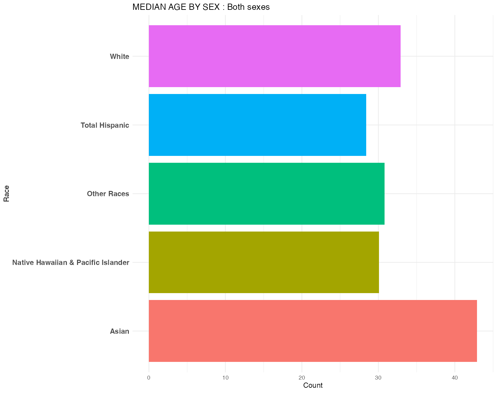
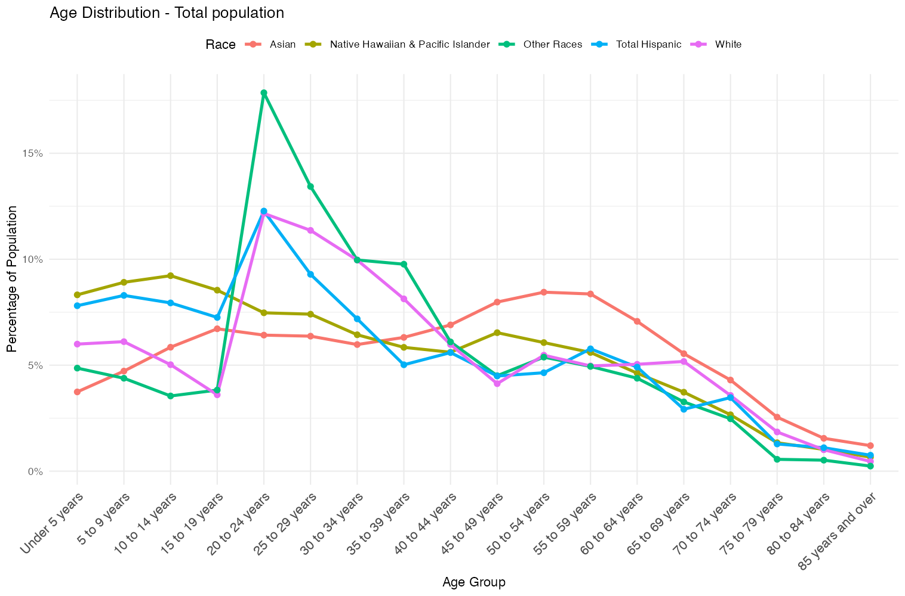

## Introduction

This project presents a Shiny App designed to explore demographic trends in Guam, a U.S. territory in the Pacific. Data is from the United States Census Bureau, DECIA Guam Detailed Cross-tabulations, 2020. The application visualizes key population metrics, includes age, sex, martial status, fertility, etc., stratified with population by different races.

https://data.census.gov/table/DECENNIALCROSSTABGU2020.CT1?q=Guam+Populations+and+People

## Method and Code

### Data Cleaning

I processed the raw census data and created a tidy dataset.

Structure & Organization: I used regular expressions to standardize column headers (removing prefixes like "Guam!!") and used row indentation levels to reconstruct hierarchical categories (e.g., Age and Sex) using the fill function.

Formatting: The data was pivoted to a long format. To ensure correct visualization, the "Age Group" variable was converted to an ordered factor to preserve order.

Missing Data (NA): Counts were converted from character to numeric types. Any resulting NA values were explicitly evaluated and replaced with 0 to prevent errors in aggregation and plotting.

```{r}
library(shiny)
library(tidyverse)
library(stringr)
library(scales)

# --- Data Cleaning Function ---
process_census_data <- function(file_path) {
  # Read data with "minimal" name repair
  raw_data <- read_csv(file_path, col_types = cols(.default = "c"), 
                       show_col_types = FALSE, name_repair = "minimal")
  
  names(raw_data)[1] <- "Label_Grouping"
  
  # Function to clean race names
  clean_race_name <- function(x) {
    x %>%
      str_replace("^Guam!!Total$", "Total Population") %>%
      str_replace("^Guam!!One Race!!Total$", "Total One Race") %>%
      str_replace("^Guam!!Hispanic or Latino \\(of any race\\)!!Total$", "Total Hispanic") %>%
      str_remove_all("Guam!!") %>%
      str_remove_all("One Race!!") %>%
      str_remove_all("Hispanic or Latino \\(of any race\\)!!") %>%
      str_replace_all("Native Hawaiian and Other Pacific Islander", "Native Hawaiian & Pacific Islander") %>%
      str_remove_all("!!Total") %>%
      str_replace_all("!!", " - ") %>%
      str_remove_all("\\[.*?\\]") %>%
      str_trim()
  }
  
  # Apply cleaning
  current_names <- names(raw_data)
  new_race_names <- sapply(current_names[-1], clean_race_name)
  final_colnames <- make.unique(c("Label_Grouping", new_race_names))
  names(raw_data) <- final_colnames
  
  # Process Hierarchical Row Labels
  clean_df <- raw_data %>%
    mutate(
      CleanLabel = str_replace_all(Label_Grouping, "\u00A0", " "),
      Indent = nchar(str_match(CleanLabel, "^ *")[, 1]),
      CleanLabel = str_trim(CleanLabel)
    ) %>%
    mutate(
      Section = ifelse(Indent == 0, CleanLabel, NA),
      SubSection = ifelse(Indent == 4, CleanLabel, NA)
    ) %>%
    fill(Section, .direction = "down") %>%
    group_by(Section) %>%
    fill(SubSection, .direction = "down") %>%
    ungroup() %>%
    mutate(
      DisplayLabel = case_when(
        Indent == 4 ~ CleanLabel, 
        Indent == 8 ~ paste0(SubSection, " - ", CleanLabel),
        Indent > 8 ~ paste0(SubSection, " - ", CleanLabel),
        TRUE ~ CleanLabel
      )
    ) %>%
    filter(Indent > 0) %>%
    pivot_longer(
      cols = -c(Label_Grouping, CleanLabel, Indent, Section, SubSection, DisplayLabel),
      names_to = "Race",
      values_to = "Value"
    ) %>%
    mutate(
      NumericValue = suppressWarnings(as.numeric(str_remove_all(Value, ","))),
      NumericValue = ifelse(is.na(NumericValue), 0, NumericValue)
    )
  
  # --- specific processing for Age Groups order ---
  # Extract the order of age groups from the file to prevent alphabetical sorting
  age_order <- unique(clean_df$CleanLabel[clean_df$Section == "SEX AND AGE" & clean_df$Indent == 8])
  
  clean_df <- clean_df %>%
    mutate(
      AgeGroup = factor(CleanLabel, levels = age_order) # Turn Age Group into an ordered factor
    )
  
  return(clean_df)
}
```

### Application Construction

The application was built using the shiny app, featuring a sidebar for global controls and a main interface divided into two panels, overview and age distribution.

Global Controls: The sidebar allows users to filter the entire dataset by specific racial groups. It also includes context inputs (such as category selection or percentage toggles) that update based on the active tab.

General Overview: This tab provides a broad exploration of demographic variables. It use horizontal bar chart and a summary table, allowing for direct comparison of raw counts across races.

Age Distribution: This tab specializes in visualizing age structures. It features a multi-lines chart, tracking population across ordered age groups. A key feature is the normalization: users can toggle between "Population Count" and "Percentage." This transformation divides the count for each age group by the total population of that race, enabling accurate trend comparisons between racial groups of vastly different sizes.

```{r}
# --- Load Data ---
file_name <- "DECENNIALCROSSTABGU2020.CT1-2025-12-08T210638.csv"
if(file.exists(file_name)) {
  df <- process_census_data(file_name)
} else {
  df <- data.frame() 
}

# --- Shiny UI ---
ui <- fluidPage(
  titlePanel("Guam Census 2020: Demographic Data by Race"),
  
  sidebarLayout(
    sidebarPanel(
      helpText("Explore demographic characteristics by Race."),
      
      # Race Selector (Global)
      checkboxGroupInput("selected_races", "Select Races to Compare:",
                         choices = unique(df$Race),
                         selected = c("Total Population", "Native Hawaiian & Pacific Islander", "Asian", "White")),
      
      hr(),
      
      # Conditional Inputs based on active tab
      conditionalPanel(
        condition = "input.main_tabs == 'Overview'",
        selectInput("topic", "Select Category:", choices = unique(df$Section)),
        uiOutput("variable_ui")
      ),
      
      conditionalPanel(
        condition = "input.main_tabs == 'Age Distribution'",
        radioButtons("age_subset", "Population Group:",
                     choices = c("Total Population" = "Total population", 
                                 "Male" = "Male population", 
                                 "Female" = "Female population")),
        checkboxInput("show_percent", "Show as Percentage", value = TRUE),
        helpText("Percentage view is recommended for comparing races with different population sizes.")
      )
    ),
    
    mainPanel(
      tabsetPanel(id = "main_tabs",
                  
                  # TAB 1: General Overview (Previous Functionality)
                  tabPanel("Overview", 
                           br(),
                           plotOutput("barPlot", height = "600px"),
                           br(),
                           dataTableOutput("dataTable")
                  ),
                  
                  # TAB 2: Age Distribution (New Feature)
                  tabPanel("Age Distribution", 
                           br(),
                           plotOutput("agePlot", height = "500px"),
                           br(),
                           h4("Age Statistics"),
                           tableOutput("ageTable")
                  )
      )
    )
  )
)

# --- Shiny Server ---
server <- function(input, output, session) {
  
  # --- Overview Tab Logic ---
  
  output$variable_ui <- renderUI({
    req(input$topic)
    filtered_data <- df %>% filter(Section == input$topic)
    selectInput("variable", "Select Metric:", choices = unique(filtered_data$DisplayLabel))
  })
  
  overview_data <- reactive({
    req(input$topic, input$variable, input$selected_races)
    df %>%
      filter(Section == input$topic, DisplayLabel == input$variable, Race %in% input$selected_races)
  })
  
  output$barPlot <- renderPlot({
    data <- overview_data()
    validate(need(nrow(data) > 0, "Select data."))
    
    # Swapped X and Y as requested previously
    ggplot(data, aes(x = NumericValue, y = Race, fill = Race)) +
      geom_col() +
      theme_minimal() +
      labs(title = paste(input$topic, ":", input$variable), x = "Count", y = "Race") +
      theme(legend.position = "none", axis.text.y = element_text(face="bold", size=11)) +
      scale_x_continuous(labels = comma)
  })
  
  output$dataTable <- renderDataTable({
    overview_data() %>% select(Section, Metric=DisplayLabel, Race, Count=Value)
  })
  
  # --- Age Distribution Tab Logic ---
  
  age_plot_data <- reactive({
    req(input$selected_races)
    
    # Filter for the Age Section and the selected Subgroup (Total/Male/Female)
    target_data <- df %>%
      filter(
        Section == "SEX AND AGE",
        SubSection == input$age_subset,
        Indent == 8, # Selects the age buckets only (removes the total sum row)
        Race %in% input$selected_races
      )
    
    # Calculate Percentages if requested
    if (input$show_percent) {
      target_data <- target_data %>%
        group_by(Race) %>%
        mutate(
          TotalInGroup = sum(NumericValue),
          Percentage = NumericValue / TotalInGroup
        ) %>%
        ungroup()
    }
    
    return(target_data)
  })
  
  output$agePlot <- renderPlot({
    data <- age_plot_data()
    validate(need(nrow(data) > 0, "No age data available."))
    
    p <- ggplot(data, aes(x = AgeGroup, group = Race, color = Race)) +
      geom_line(aes(y = if(input$show_percent) Percentage else NumericValue), size = 1.2) +
      geom_point(aes(y = if(input$show_percent) Percentage else NumericValue), size = 2) +
      theme_minimal() +
      theme(
        axis.text.x = element_text(angle = 45, hjust = 1, size = 11),
        legend.position = "top"
      ) +
      labs(
        title = paste("Age Distribution -", input$age_subset),
        x = "Age Group",
        y = if(input$show_percent) "Percentage of Population" else "Population Count"
      )
    
    if(input$show_percent) {
      p <- p + scale_y_continuous(labels = scales::percent_format(accuracy = 1))
    } else {
      p <- p + scale_y_continuous(labels = scales::comma)
    }
    
    return(p)
  })
  
  output$ageTable <- renderTable({
    data <- age_plot_data()
    
    display_cols <- c("AgeGroup", "Race", "Value")
    if (input$show_percent) {
      data$Percentage <- scales::percent(data$Percentage, accuracy = 0.1)
      display_cols <- c("AgeGroup", "Race", "Value", "Percentage")
    }
    
    data %>%
      select(all_of(display_cols)) %>%
      pivot_wider(names_from = Race, values_from = if(input$show_percent) "Percentage" else "Value")
  })
}

shinyApp(ui = ui, server = server)
```

## Results and Analysis

Here are some selected output from the Shiny app.

### Demographic Overview

 Figure 1: Total Population by Racial Group

The "Overview" tab allows for a direct comparison of population counts across different racial demographics. Figure 1 displays the total population for five key groups. The chart highlights that Native Hawaiian & Pacific Islanders are the largest racial group in Guam (exceeding 60,000 individuals in this dataset), followed closely by the Asian population (approximately 55,000). In contrast, the White, Hispanic, and Other Race populations are significantly smaller, with the White population appearing as the third largest group at just over 10,000. This visualization shows the app's ability to quickly identify the island's primary demographic composition, showing a population heavily skewed towards Pacific Islander and Asian communities.

### Detailed view of Pacific Islander

 Figure 2: Breakdown of Native Hawaiian & Pacific Islander Population

While Figure 1 identified "Native Hawaiian & Pacific Islander" as the largest aggregate racial group, the app allows for a breakdown into specific ethnic origins. Figure 2 displays the population distribution within this category. The Chamorro population is the largest subgroup, accounting for approximately 50,000 individuals. This aligns with Guam's history as the indigenous homeland of the Chamorro people. The Chuukese represents the second-largest specific subgroup, with a population count exceeding 10,000.

### Comparative Age Demographics

 Figure 3: Median Age by Racial Group

Figure 3 transitions the analysis from raw population counts to demographic characteristics, specifically Median Age. This metric offers insight into the generational structure of each community. The Asian population exhibits the highest median age, exceeding 40 years. This suggests a more mature demographic profile compared to other groups on the island. In contrast, the Native Hawaiian & Pacific Islander and Total Hispanic populations show significantly lower median ages (approximately 30 and 28 years). This points to a younger population structure.

### Age Structure and Distribution Trends

 Figure 4: Age Distribution by Race (Percentage View)

Figure 4 displays age distribution as a percentage of the total population for each race. This allows for a fair comparison of demographic shapes despite the large disparities in absolute population sizes. There exists a "Young Adult", that a sharp, distinctive peak is visible in the 20 to 24 years age bracket for the Other Races (green), Total Hispanic (blue), and White (purple) populations. On contrast, The Asian population (red line) follows a completely different trajectory. It remains low in the youth brackets (under 20) and rises steadily to peak in the 50 to 59 years range.

## Conclusion

By cleaning and visualizing the 2020 Guam dataset, the analysis revealed distinct structural differences among racial groups, using the Shiny application in R. Shiny is good at interaction and visualization on data, showing some characteristics of population and age. The dataset also includes extra data such as sex, marital status and fertility, that also included in the app.
